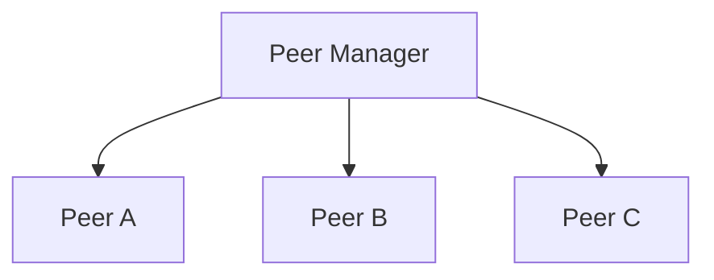
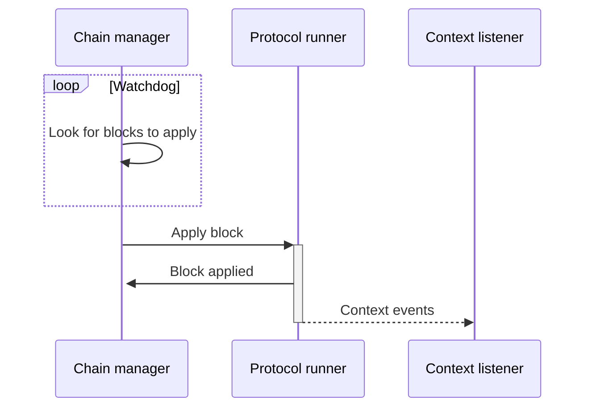

# Architecture

This document describes the high level architecture of the TezEdge node.

## Shell

The shell consists of several actors working together.

## Peer Manager

The network level is responsible for peer to peer (P2P) network communication with remote peers.

At the top level sits the Peer Manager, which is responsible for establishing network connection to remote peers.

The peer manager also accepts incoming connection from remote peers.

When the peer is started, it will first try to start bootstrapping procedure. If the bootstrap is successful then it will
start to accept messages from the connected remote peer. The same peer is also used to transmit messages to the remote peer.

Messages from peer manager are cryptographically validated and then sent up to the shell.

### Chain Manager

The chain manager is responsible for chain synchronization.

This actor is monitoring whether every block (except genesis) has its predecessor. If not, it will try to get it from one of the connected peers.

### Chain Feeder

The chain feeder periodically runs checks to see if it's possible to apply next block to the protocol.

We are using the word _feed_ here because this actor is not _applying_ the block directly, but instead it is sending the block via IPC to the protocol runner, another type of process. We will describe the protocol runner later on in this article.

### Context Listener

The context listener listens to the context events that are generated when a block is applied to the protocol. These events are transferred from the protocol runner to the context listener via the IPC.

**The following graph depicts how blocks are applied.**

