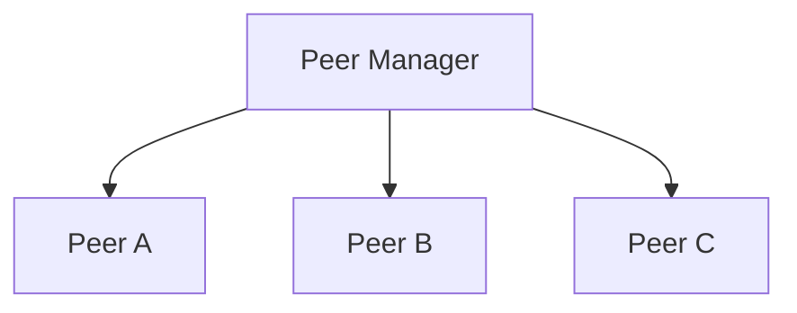
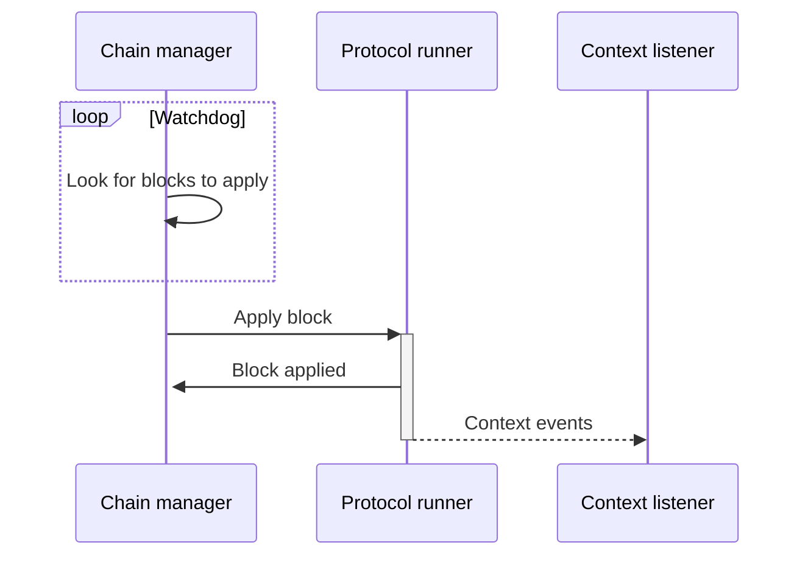

# Architecture

This document describes high level architecture of a Tezedge node.

## Shell

Shell consists of several actors working together.

## Peer Manager

Networking level is responsible for p2p network communication with remote peers.

At the top level sits a Peer Manager which is responsible for establishing network connection to remote peers.

Peer manager also accepts incoming connection from remote peers.

When peer is started it will first try to start bootstrapping procedure. If the bootstrap is successful then it will
start to accept messages from the connected remote peer. The same peer is also used to transmit messages to the remote peer.

Messages from Peer manager are, after cryptographic validation, sent up to the Shell.

### Chain Manager

Chain manager is responsible for chain synchronization.

This actor is monitoring if every block (except genesis) has its predecessor. If not, it will try to get it from one of
the connected peers.

### Chain Feeder

Chain feeder is periodically running checks to see if it's possible to apply next block to the protocol.

We are using the word _feed_ here because this actor is not _applying_ the block directly, but instead it is sending
the block via IPC to another process. Name of that  another process is Protocol Runner.
We will describe Protocol runner later in the text.

### Context Listener

Context listener is listening for context event generated when block is applied by the protocol.
Events are transferred from Protocol runner to Context listener via IPC.

**The following graph depicts how blocks are applied.**

