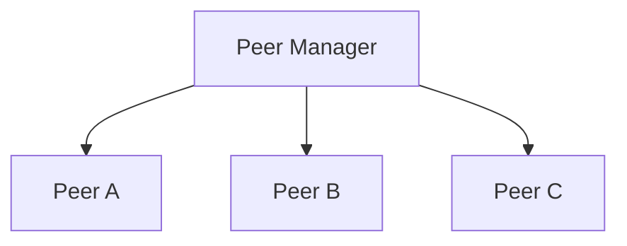
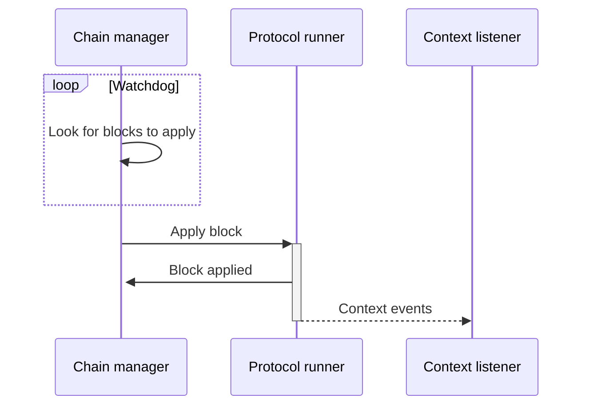

# Architecture

This document describes the high level architecture of the TezEdge node.

Increasing the complexity of software will always increase the likelihood of an error occurring. This holds true not just for coding, but also in a general sense—complex systems have a great number of moving parts, many of which also need communicate with one another. A fault in any part, or in the connection between them, may cause an error. If such an error is not contained, it may spread and lead to a system-wide failure.

Diligent coding and regular revisions can only get you so far. Even the best software will eventually run into an error. A Swiss train can similarly be dilligently prepared to run on schedule, but an unforeseen circumstance may cause it to be delayed. However, the question isn’t whether we can *always* prevent an error or a delay—we know it is impossible. Rather, the questions are: what can we do to contain the problem and minimize its effects on the service that is provided? 

**Fault tolerance**

A fault-tolerant system behaves in a reasonable manner in the presence of errors. The advantage of a fault-tolerant system is that the service will continue to be provided even when it runs into an error. 

This is achieved by establishing a hierarchy of tasks:

* Upper level tasks maintain the system, without them, the application will not run. 
* Lower level tasks are done to improve performance, which means that even if they are not performed, the system will continue working, although service may be limited.

If an error is detected when trying to achieve a goal, we make an attempt to correct the error. If we cannot correct the error we immediately abort the current task and start performing a simpler task.

**Error isolation**

Software is almost always written by a team (or teams) of developers. Different developers write different modules, but an error in one module must not affect other modules. 

We need to create a layer of separation between modules to prevent the spread of errors. For this, we use the concept of an *actor model*. 

**The actor model**

The actor model is a conceptual model for software systems. Think of it as a general rulebook for how the system’s components should interact with each other. 

Actors provide protection domains, so that an error in one actor cannot affect the operation of other actors. Different developers write different applications which are run in separate actors; errors in one application should not have a negative influence on the other applications running in the system.

At an abstract level, the actor model solves the issue of communication within code, similarly to how a company’s employees share information between each other.

**Actors**

An actor is a primitive unit of computation that is capable of performing tasks, but is completely separated from other actors. In the actor model, an actor is analogous to what an object is in object-oriented programming. The key difference is that actors are completely separated and they never share memory.

Actors have addresses to which other actors send messages. By sending a message, an actor delegates a task onto a different actor. While multiple actors can perform tasks concurrently, a single actor handles multiple tasks sequentially, meaning that if you send three messages with tasks to a single actor, it will only be able to perform one task at a time. If you want these tasks performed concurrently, you must have three actors, each of whom will receive one message and perform one task.

When an actor receives a message, it can do the following actions:
* Create additional actors
* Send messages to other actors
* Determine what to do with the next message

# Actors in the TezEdge shell

The TezEdge shell consists of several actors working together.

**Peer Manager**

The network level is responsible for peer to peer (P2P) network communication with remote peers.

At the top level sits the Peer Manager, which is responsible for establishing network connection to remote peers.

The peer manager also accepts incoming connection from remote peers.

When the peer is started, it will first try to start bootstrapping procedure. If the bootstrap is successful then it will
start to accept messages from the connected remote peer. The same peer is also used to transmit messages to the remote peer.

Messages from peer manager are cryptographically validated and then sent up to the shell.

**Chain Manager**

The chain manager is responsible for chain synchronization.

This actor is monitoring whether every block (except genesis) has its predecessor. If not, it will try to get it from one of the connected peers.

**Chain Feeder**

The chain feeder periodically runs checks to see if it's possible to apply next block to the protocol.

We are using the word _feed_ here because this actor is not _applying_ the block directly, but instead it is sending the block via IPC to the protocol runner, another type of process. We will describe the protocol runner later on in this article.

**Context Listener**

The context listener listens to the context events that are generated when a block is applied to the protocol. These events are transferred from the protocol runner to the context listener via the IPC.

**The following graph depicts how blocks are applied.**

