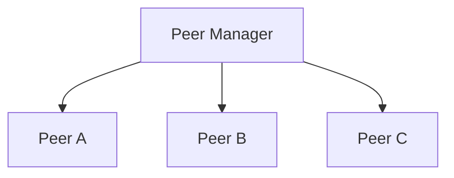
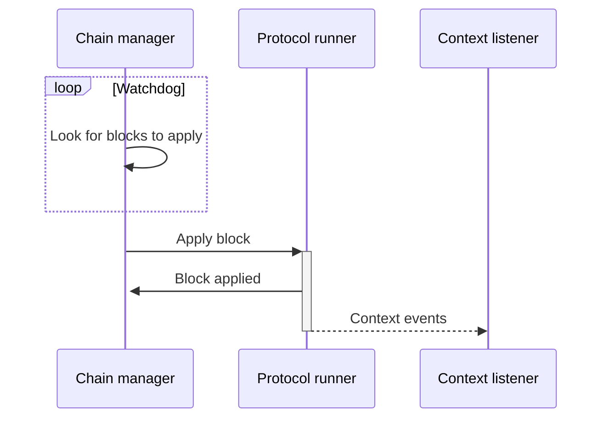

# Architecture

**Introduction**

This section of the document describes the values of the TezEdge node's architecture.

Increasing the complexity of software will always increase the likelihood of an error occurring. This holds true not just for coding, but also in a general sense—complex systems have a great number of moving parts, many of which also need communicate with one another. A fault in any part, or in the connection between them, may cause an error. If such an error is not contained, it may spread and lead to a system-wide failure.

Diligent coding and regular revisions can only get you so far. Even the best software will eventually run into an error. A Swiss train can similarly be painstakingly prepared to run on schedule, but a single unforeseen circumstance may cause it to be delayed. However, the question isn’t whether we can *always* prevent an error or a delay—the innate randomness of the external world makes this impossible. Rather, the question is: what can we do to contain the problem and minimize its effects on the service that is provided? 

**Fault tolerance**

A fault-tolerant system behaves in a reasonable manner in the presence of errors. The advantage of a fault-tolerant system is that the service will continue to be provided even when it runs into a problem. 

TezEdge must be a fault-tolerant system because, as a node shell, it provides an essential service to users with a stake in the Tezos blockchain. 

Since there are significant finances at stake, security is paramount to our interests. We primarily seek to minimize the software’s vulnerability, specifically, to prevent malicious parties from exploiting errors to hack the system, e.g. validate false transactions.

As the TezEdge node provides an essential service to users with a stake in the Tezos blockchain, our secondary objective is to maintain the service and continue providing it even if the node runs into problems. However, the provision of service should never be prioritized over the node’s security.

Fault-tolerance is achieved by establishing a hierarchy of tasks:

* Upper level tasks maintain the system, without them, the application will not run. 
* Lower level tasks are done to improve performance, which means that even if they are not performed, the system will continue working, although service may be limited.

**Undefined behavior**

Unlike C and C++, Rust does not allow a program to be run if its code will cause unpredictable actions, also known as undefined behavior. The Rust compiler detects code that causes undefined behavior and prevents the program from being launched. 

The only exception to this prevention of undefined behavior happens the code is tagged unsafe. Since the Rust-based TezEdge node communicates with the native OCaml Tezos node, there are areas in which undefined behavior will happen.

**Unwinding**

The process by which Rust handles errors is known as unwinding. In case a Rust program runs into an error, it has a tiered set of solutions:

**1. Option** is used in case there is a reasonable absence of a value or information.
**2. Result** is used if something goes wrong, but can be reasonably handled.
**3. Panic** is used if the the problem cannot be reasonably handled.
**4. Abort** is used if something catastrophic happens and the program must terminate immediately.

This set of solutions is aimed at preventing, handling and containing errors. When errors do happen, Rust will first figure out how serious they are and then apply a solution. This helps maintain the service even in the presence of some errors, but will ultimately abort the program if there is a catastrophic fault. 

If an error is detected when trying to achieve a goal, we make an attempt to correct the error. If we cannot correct the error we immediately abort the current task and start performing a simpler task.

**Error isolation**

Software is almost always written by a team (or teams) of developers. Different developers write different modules, but an error in one module must not affect other modules. 

We need to create a layer of separation between modules to prevent the spread of errors. For this, we use the concept of an *actor model*. 

**The actor model**

The actor model is a conceptual model for software systems. Think of it as a general rulebook for how the system’s components should interact with each other. 

Actors provide protection domains, so that an error in one actor cannot affect the operation of other actors. Different developers write different applications which are run in separate actors; errors in one application should not have a negative influence on the other applications running in the system.

At an abstract level, the actor model solves the issue of communication within code, similarly to how a company’s employees share information between each other.

**Actors**

An actor is a primitive unit of computation that is capable of performing tasks, but is completely separated from other actors. In the actor model, an actor is analogous to what an object is in object-oriented programming. The key difference is that actors are completely separated and they never share memory.

Actors have addresses to which other actors send messages. By sending a message, an actor delegates a task onto a different actor. While multiple actors can perform tasks concurrently, a single actor handles multiple tasks sequentially, meaning that if you send three messages with tasks to a single actor, it will only be able to perform one task at a time. If you want these tasks performed concurrently, you must have three actors, each of whom will receive one message and perform one task.

When an actor receives a message, it can do the following actions:
* Create additional actors
* Send messages to other actors
* Determine what to do with the next message

# The shell and its actors

This section of the document describes the high level architecture of the TezEdge node.

The TezEdge shell consists of several actors working together:

**Peer Manager**

The network level is responsible for peer to peer (P2P) network communication with remote peers.

At the top level sits the Peer Manager, which is responsible for establishing network connection to remote peers.



The peer manager also accepts incoming connection from remote peers.

When the peer is started, it will first try to start bootstrapping procedure. If the bootstrap is successful then it will
start to accept messages from the connected remote peer. The same peer is also used to transmit messages to the remote peer.

Messages from peer manager are cryptographically validated and then sent up to the shell.


**P2P layer**

This layer is used for communication between two nodes on the network. The communication begins with both nodes sending a bootstrapping message to the other, therefore exchanging information such as their keys, cryptographic nonces and the version of the P2P protocol.

This part of communication is still unencrypted. Encryption of messages starts from the moment both nodes have received and accepted the bootstrap messages.

In case one node does not accept the bootstrap node sent to it by the other node, it will send a 'Nack' message and the communication will end.

Once communication is encrypted, the nodes begin sending messages containing blocks and their operations. The chain is synchronized via these messages. A node that does not have a fully synced chain requests information from other nodes in the network, but it can also provide blocks and operations it already has to the other nodes in the network.


**Chain Manager**

The chain manager is responsible for chain synchronization.

This actor is monitoring whether every block (except genesis) has its predecessor. If not, it will try to get it from one of the connected peers.


**Chain Feeder**

The chain feeder periodically runs checks to see if it's possible to apply next block to the protocol.

We are using the word _feed_ here because this actor is not _applying_ the block directly, but instead it is sending the block via IPC to the protocol runner, another type of process. We will describe the protocol runner later on in this article.

**Context Listener**

The context listener listens to the context events that are generated when a block is applied to the protocol. These events are transferred from the protocol runner to the context listener via the IPC.

**The following graph depicts how blocks are applied.**



**RPC**
 
The RPC is relatively simple more or less standardized. We currently have the same number of functional endpoints as the original Tezos node. 
 
The REST endpoint is a technically standardized method of calling various web operations.
It is exposed (for instance, ```chains/main/blocks/{block_id}``` where ```{block_id}``` is the parameter of the endpoint). 
 
The user can call the endpoint from their application or browser by adding the endpoint address. For instance, if the node is running locally and the RPC is at ```port  18732```, the user can all this RPC by entering the entire address as such: ```localhost:18732/chains/main/blocks/head```
 
The node first sparses the endpoint, checking whether it is valid or not. It then extracts the arguments from it (this is known as routing). This launches a mapped function within the node. We recognize two categories of endpoints:

**1. Endpoints that read data**

Based on the arguments, the endpoint figures out which part of the database it is supposed to read from. The data is read, then serialized into a JSON format and returned as the result of the function. 
 
For instance with ```chains/main/blocks/head```, we know that the user is requesting the database for data about blocks, therefore we know where to read from and we also know that the block head is a special value for the block at the highest level.

**2. Endpoints that interact with the system**

Since these endpoints interact with the system itself, we expect them to influence the node.
 
For instance, the endpoint ```/network/peers/<peer_id>/ban``` informs the node that it should disconnect from a peer and cease connecting to them. Since the node is operating on the actor model, it is necessary to use ask pattern which is a method of communicating with the external actors. In this case, the network manager (an actor in charge of peer connections) is requested to disconnect a peer with the specified id and place them on a blacklist. Note that we are currently working on implementing these endpoints. 
