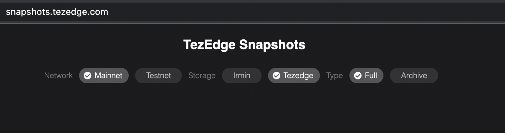

# The TezEdge Baker — a daemon for creating, signing and injecting endorsements and blocks

The process of validating new blocks is essential to every blockchain. Without it, it would be impossible to process new transactions and thus the blockchain would be unable to continue operating. 

In so-called Proof of Stake (PoS) blockchains, validation is done by users who have a ‘stake’, meaning that they own a certain amount of the blockchain’s tokens. Stakers are periodically chosen by the blockchain’s consensus algorithm to validate new blocks, and their chance of being selected is proportionate to the size of their stake.

The consensus algorithm of Tezos is based on PoS, but it has its own set of unique features, which is why it is known as liquid proof of stake (LPoS). In Tezos, staking is known as baking, and bakers must own a certain amount of ꜩ (currently 6000 ꜩ) to be able to validate new blocks.

Baking involves the use of the baker’s private key, which means that security is of absolute importance. In case there is a serious security vulnerability, an adversary could steal funds from the baker. Furthermore, since the introduction of the Tenderbake algorithm (Ithaca and later protocols), the baker is more complex than before. With increased complexity, there is also an increase in potential vulnerabilities.

For this reason, we wanted to ensure that our implementation of the baker has the highest level of security possible. To achieve that, we wanted to utilize fuzzing. However, the old baker implementation was difficult to fuzz, so we created our own implementation of the Tezos baker. We wrote it in Rust and designed it with fuzzing in mind. Additionally, it also requires less resources (CPU, memory) and it also shares some code with the TezEdge node. 


### A new baker implementation

The Tezos blockchain undergoes periodic updates to its consensus protocol. These updates improve the core features of the blockchain such as network stability, security, block validation and so on. However, with each new protocol, software developed for Tezos such as node shells and bakers must also be updated in order to continue working. For example, you cannot use a baker developed for the Hangzhou protocol on a network with the Ithaca protocol. 

Previous protocols also required an endorser which validates blocks, but since Ithaca was implemented, the baker and endorser are the same entity. This is because Ithaca uses the new consensus algorithm where baking and validating are very tightly related.

Since Ithaca, we have our own baker implementation that is written in Rust and benefits from shared codebase with TezEdge.


### How it works

The TezEdge baker interacts with the TezEdge or Octez node and determines when it has the right to propose or validate blocks. The rights to propose or validate are randomly distributed among the delegates in the network, but it is proportional to their stake - the more tokens a delegate has, the greater the chance of gaining the right to propose and validate blocks, thus earning more rewards. 

The precise moment to propose a block and the header/content of the block (or content of the validation operation) depends on network events and the state of the baker. It must follow a set of sophisticated rules known as the Tenderbake consensus algorithm. Basically, the baker is running on the Tenderbake algorithm.

Please note that the Baker should be kept running at all times to ensure no reward is missed.

Not everyone has 6000 ꜩ, and some of those who do have enough tokens can’t keep their baker running 24/7. In such a case, it is more beneficial to _delegate_ their tokens (transfer their baking rights) to another baker. Then the baker then repays a share of their reward to the delegator, minus a percentage-based fee.

The common problem here is how to automate the repayment of rewards to delegators. We are planning to create a tool to solve it. The baker may want to set up some rules such as the minimal delegation amount or the fee they are charging. They may want to see a summary of who is delegating to them, or how many delegates there are, what is the baking efficiency, how much rewards they’ve earned and the total fee that was charged from delegators, what is the average return on investment. The baker could possibly want to introduce some extra incentives to have more delegators. All these tasks require a tool, and it’s something we’re considering developing in the future.


### Try out the new baker
## Running

### Prerequisites

|  OS  |      Versions      |
|----------|:-------------:|
| Ubuntu |  16.04, 18.04, 18.10, 19.04, 19.10, 20.04, 20.10, 21.04, 21.10, 22.04 |
| Debian |  9, 10 |
| OpenSUSE |  15.1, 15.2 |
| CentOS |  8 |
| MacOS |  *experimental* - newer or equal to 10.13 should work, Intel and M1 cpus |

1. Install **Git** (client), **Curl**, a several other tools and libs in your OS. In Ubuntu and Debian it will be:
    ```
    sudo apt install git curl libssl-dev clang gcc pkg-config make libsodium-dev libev-dev
    ```
2. Install **Rust** command _(We recommend installing Rust through rustup.)_
    ```
    # Run this in your terminal, then follow the onscreen instructions.
    curl https://sh.rustup.rs -sSf | sh
    source ~/.cargo/env
    ```
3. Install **Rust toolchain** _(Our releases are built with 1.58.1.)_
    ```
    rustup toolchain install 1.58.1
    rustup default 1.58.1
    ```
4. Install **Tezos Client** and **Tezos Signer**
    ```
    curl https://gitlab.com/tezos/tezos/-/package_files/36986666/download -o tezos-client
    chmod +x tezos-client
    sudo mv tezos-client /usr/local/bin
    curl https://gitlab.com/tezos/tezos/-/package_files/36986689/download -o tezos-signer
    chmod +x tezos-signer
    sudo mv tezos-signer /usr/local/bin
    ```

### Building

#### Option 1

Use the tool cargo, which is part of **Rust** already installed in the previous step:
```
cargo install --git https://github.com/tezedge/tezedge --tag v2.3.2 baker
```

You can install the latest development version using `--branch develop` instead of `--tag v2.3.x`.

```
cargo install --git https://github.com/tezedge/tezedge --branch develop baker
```

The cargo will create the binary `tezedge-baker` at `~/.cargo/bin`. The directory `~/.cargo/bin` should be in your `$PATH` variable, so you can run `tezedge-baker` without the full path. If it is not working (it might not work if you are using a non-standard shell), execute `source ~/.cargo/env` to update the environment.

#### Option 2

Clone sources and build:
```
git clone https://github.com/tezedge/tezedge
cd tezedge
git checkout tags/v2.3.2 -b v2.3.2
cargo build -p baker --release
```

The binary will be in `target/release`.

Make sure you copy the binary into one of the directories listed in `$PATH` variable, for example:

```
sudo cp target/release/tezedge-baker /usr/local/bin
```

### Run the TezEdge node

Get the source code, and build the node

```
git clone https://github.com/tezedge/tezedge
cd tezedge
git checkout tags/v2.3.2 -b v2.3.2
cargo build -p light-node -p protocol-runner --release
```

Open the page [Snapshots](http://snapshots.tezedge.com), choose the network either mainnet or testnet. Choose Storage: tezedge, and Type: Full.



You will see blocks, each block is a snapshot, the top-most block is most recent snapshot. Every day, a new link to the snapshot will appear. Copy the link.


To run the node on testnet use the following commands, replace `...` with the actual link copied on previous step:
```
mkdir -p "$HOME/data-ithacanet/tezedge-data"
./target/release/light-node import-snapshot \
    --from ... \
    --tezos-data-dir "$HOME/data-ithacanet/tezedge-data"
KEEP_DATA=1 ./run.sh release \
    --network=ithacanet \
    --tezos-data-dir "$HOME/data-ithacanet/tezedge-data" \
    --tezos-context-storage=tezedge
```

To run the node on mainnet, use the following commands:
```
mkdir -p "$HOME/data-mainnet/tezedge-data"
./target/release/light-node import-snapshot \
    --from ... \
    --tezos-data-dir "$HOME/data-mainnet/tezedge-data"
KEEP_DATA=1 ./run.sh release \
    --network=mainnet \
    --tezos-data-dir "$HOME/data-mainnet/tezedge-data" \
    --tezos-context-storage=tezedge
```

The node will be building for some time and then it will run. Keep it running. Continue in another terminal tab.

### Prepare an account

Skip this section if you already have a Tezos account ready for baking.

Pick a new <delegate_alias> and generate a new Tezos account using the Octez client.

```
tezos-client -E "http://localhost:18732" gen keys <delegate_alias>
```

You need to fund this account with at least 6000 ꜩ. Register the account as a delegate and wait the amount of time equal to between 5 and 6 cycles, depending on the position in the cycle (approximately 15 days).

```
tezos-client -E "http://localhost:18732" register key <delegate_alias> as delegate
```

By default, tezos-client stores the secret key for the account in the `$HOME/.tezos-client` directory.

See the [baking documentation](../../baking/mainnet/README.md#initialize-keys-for-bakerendorser) for more details.

See the [Key management](https://tezos.gitlab.io/user/key-management.html) guide for more information.

### Use ledger

Alternatively, you can use an external ledger.

Install tezos baker app in ledger by using ledger-live gui tool. You also need to open baker app and enable baking.

Run signer, it will be running in background:
```
nohup tezos-signer \
    -E "http://localhost:18732" \
    launch http signer &
```

After that, run this in the terminal
```
tezos-signer \
    -E "http://localhost:18732" \
    list connected ledgers
```

It will print something like this:
```
To use keys at BIP32 path m/44'/1729'/0'/0' (default Tezos key path), use one
of:
  tezos-client import secret key ledger0 "ledger://reckless-duck-mysterious-wallaby/bip25519/0h/0h"
  tezos-client import secret key ledger0 "ledger://reckless-duck-mysterious-wallaby/ed25519/0h/0h"
  tezos-client import secret key ledger0 "ledger://reckless-duck-mysterious-wallaby/secp256k1/0h/0h"
  tezos-client import secret key ledger0 "ledger://reckless-duck-mysterious-wallaby/P-256/0h/0h"
```

User must choose ed25519 link and run:
```
tezos-signer \
    -E "http://localhost:18732" \
    import secret key <delegate_alias> "ledger://reckless-duck-mysterious-wallaby/ed25519/0h/0h"
```

This will print `added: tz1...`, it is your public key. Run the following command to import it. The command has `secret key` words, but it is working with the link that contains public key hash, the real secret key is still inside the ledger, and isn't exposed.
```
tezos-client 
    -E "http://localhost:18732" \
    import secret key <delegate_alias> http://localhost:6732/tz1...
```

And finally, the Tezos Baking application on the Ledger should be configured for baking:
```
tezos-client \
    -E "http://localhost:18732" \
    setup ledger to bake for <delegate_alias>
```

If you did not done it before, you need to fund this account with at least 6000 ꜩ. Register the account as delegate and wait the amount of time equal to between 5 and 6 cycles, depending on the position in the cycle (approximately 15 days).

```
tezos-client -E "http://localhost:18732" register key <delegate_alias> as delegate
```

### Run the baker

_Note: It is recommended to run the baker with nohup_

Assuming that the secret key (or locator for remote signing) is in `$HOME/.tezos-client` and the node is running locally and uses 18732 port for RPC, the command is:

```
nohup tezedge-baker --base-dir "$HOME/.tezos-client" --endpoint "http://localhost:18732" --baker <delegate_alias> &
```

Additionally, you can run `tezedge-baker --help` to get short help.

Options:

- `--base-dir`: The base directory. The path to the directory where the baker can find secret keys, or the remote signer's location. Usually, it is `~/.tezos-client`. Also, this directory is used by baker as a persistent storage of the state. It is crucial, for example, when revealing the seed nonce in a new cycle.
- `--endpoint`: TezEdge or Tezos node RPC endpoint. Usually the port is `8732` or `18732`. If node is running locally, it will be `http://localhost:8732`.
- `--baker`: The alias of the baker.
- `--archive` or `-a`: If this flag is used, the baker will store verbose information for debug in the base directory.

### Common problems

1. After creating an account and registering it as a delegate, make sure you wait at least 5 cycles (approximately 15 days) before you start to bake.
1. The executable `tezedge-baker` and `tezos-client` should be in the directory which is in the `$PATH` environment variable. It may be `/usr/local/bin`, you need superuser permission to copy in this directory. Also, it is possible to execute `tezos-client` from any directory, but you need to specify the full path, for example `/home/username/tezos/tezos-client gen keys bob`, instead of `tezos-client gen keys bob`.

## Tests

Run from the source code directory:

```
cargo test -p baker
```

### Fuzzing

Install Rust nightly-2021-12-22 and cargo-fuzzcheck from source.

```
rustup install nightly-2021-12-22
cargo +nightly-2021-12-22 install --git https://github.com/tezedge/fuzzcheck-rs cargo-fuzzcheck
```

Run it from the directory `apps/baker`:

```
cargo +nightly-2021-12-22 fuzzcheck --test action_fuzz test_baker
```

### Mitten tests

Prepare Tezos with mitten.

```
git clone https://gitlab.com/nomadic-labs/tezos.git tezos-mitten -b mitten-ithaca
cd tezos-mitten
opam init --disable-sandboxing
make build-deps
eval $(opam env)
make
make mitten
```

Rename the file `tezos-mitten/tezos-baker-012-Psithaca` to `tezos-mitten/tezos-baker-012-Psithaca.octez`

Copy the files `tezedge/apps/baker/tezedge.env` and `tezedge/apps/baker/tezos-baker-012-Psithaca` into the `tezos-mitten` directory.

Build the baker and copy the binary into `tezos-mitten`.

From the `tezedge` directory:
```
cargo build -p baker --release
cp target/release/tezedge-baker ../tezos-mitten/tezos-baker-012-Psithaca.tezedge
```

Now you can run the mitten scenario:

From the `tezos-mitten` directory:
```
dune exec src/mitten/scenarios/no_eqc_stuck.exe
```

You can find more scenarios in `src/mitten/scenarios`.
